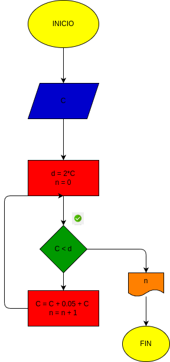

# inter-s_compuesto
programa de python para duplicar el capital de c por el 5% mensual hasta cumplir con la meta de duplicar 

# diagrama 
 

# conclusion
- siempre dara 15 meses debido a que es el mismo interes aplicado para todos los capitales 